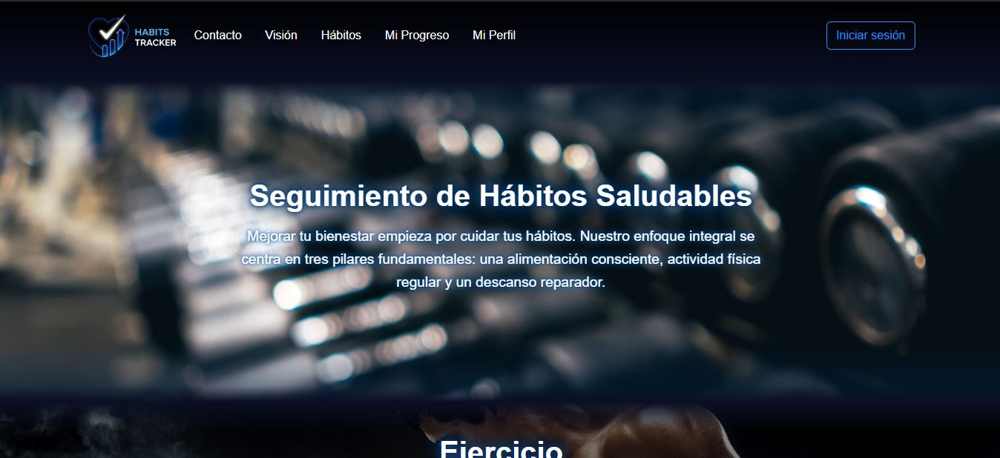
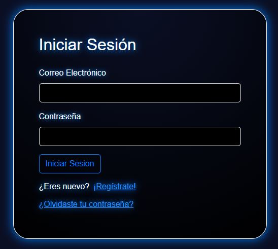
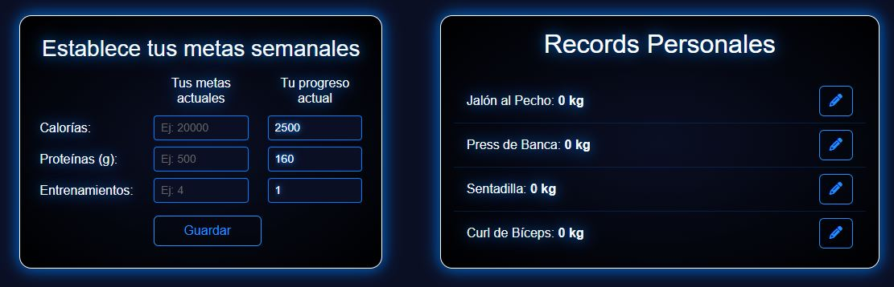
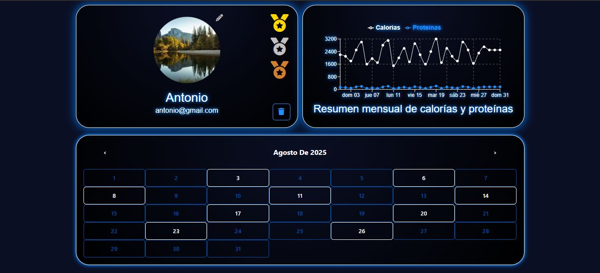

[Español](README.es.md) | English

# Habits Tracker

**Habits Tracker** is the final project of the Full Stack Bootcamp at 4Geeks Academy, developed by me and my teammates.  
It’s an application designed to register and track daily healthy habits, focusing on **sleep, nutrition, and exercise**.

## ✨ Features

- Daily registration of healthy habits  
- Statistics and progress charts  
- Calendar view to check habit entries  
- Personal record setting (e.g., running 20 km)  
- Weekly goal setting  

## 🛠️ Used Technologies

- **Back-end development:** Python (Flask)  
- **Front-end development:** JavaScript, HTML, CSS  
- **Frameworks & libraries:** React.js, Redux, Bootstrap  
- **Database:** SQL (SQLAlchemy)  
- RESTful API integration between front-end and back-end  
- Authentication with **JWT (JSON Web Tokens)**  
- Integration of third-party services (external APIs)  
- Version control with **Git & GitHub**  

## 📸 Screenshots

### Home


### Login


### Goals and Personal records


### Profile


## 🚀 Installation & Usage

### 1. Clone the repository
```bash
git clone https://github.com/usuario/habits-tracker.git

cd habits-tracker
npm install
npm run start

cd api
pipenv install
pipenv run start
```

## 👨‍💻 Authors
- [Antonio Borrero](https://github.com/Antonio-Borrero)  
- [Ruben Fajardo](https://github.com/RubFajardo)  
- [Daniela Padilla](https://github.com/danipadi13)

